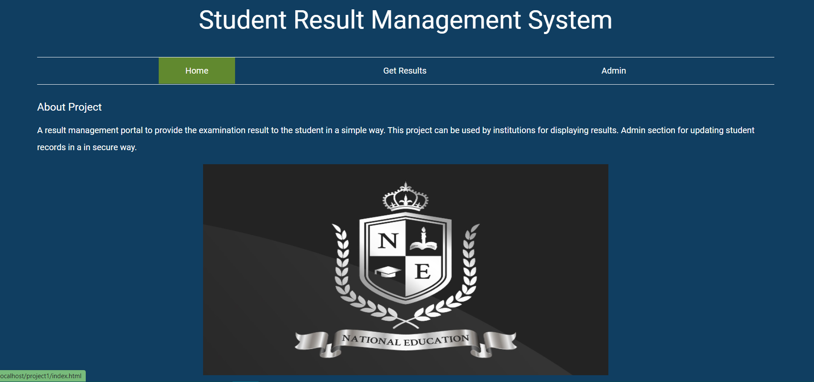
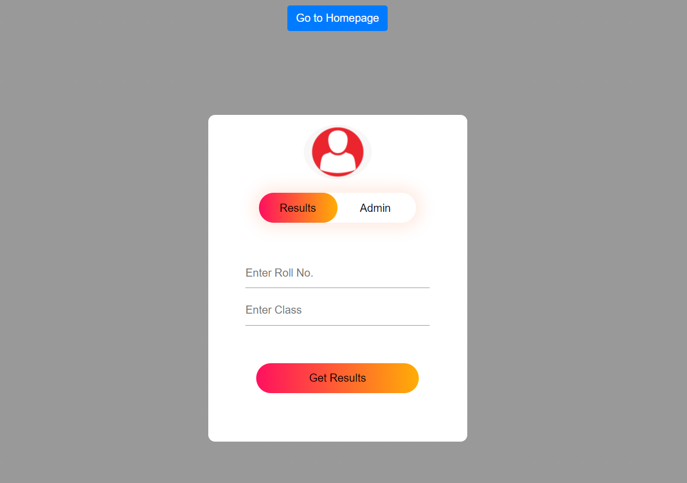
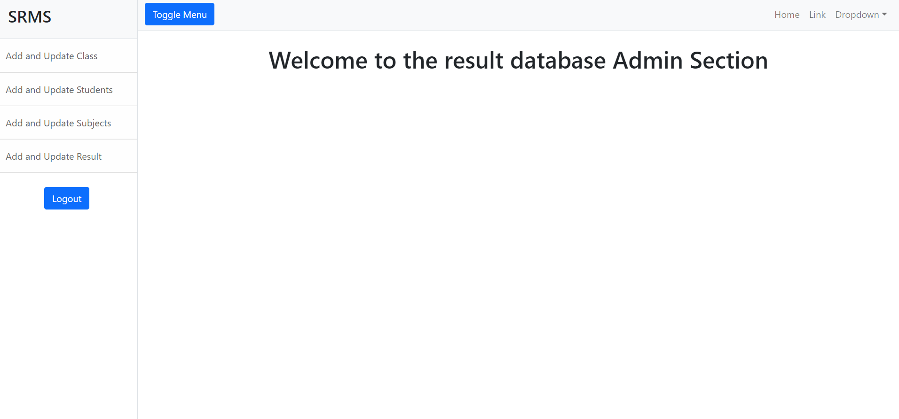
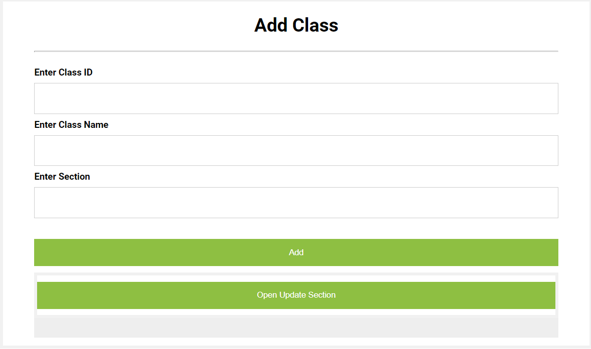
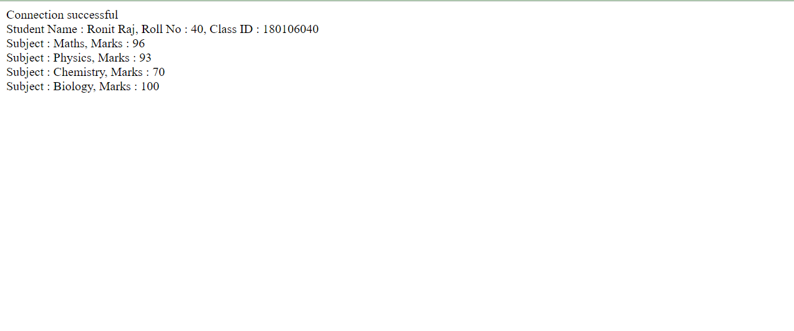

#  Student Result Management System

A result management portal to provide the examination result to the student in a simple way. This project can be used by institutions for displaying results. Admin section for updating student records in a in secure way.

## Technology Used

- Front end: HTML, CSS  
- Back end: PHP, MySQL   
- Server: XAMPP Server

## Admin Features

- Admin Dashboard  
- Admin can add and update Class info  
- Admin can add and update Subjects info  
- Admin can add and results   
- Admin can new student record and also edit info of the student.   

## Student Features

- Student can search their result using valid rollid  

## Screenshots

### Homepage 

### Login 

### Admin Dashboard 

### Add and Update Section

### Student Marks 

 

 

 

 

 

